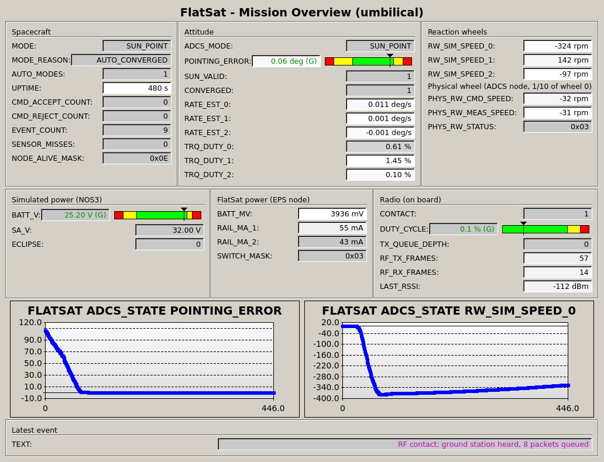
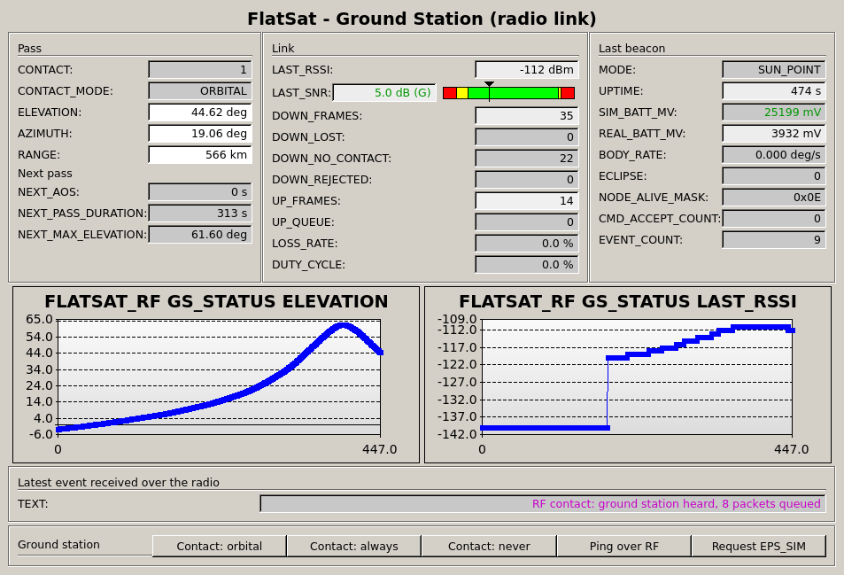

# HITL FlatSat

A hardware-in-the-loop FlatSat: four real Raspberry Pi Pico 2 subsystem boards, tested against a simulated orbit from NASA's [NOS3](https://github.com/nasa/nos3) small-satellite testbed.

> **Status:** early development. The software-in-the-loop phase runs during October 2026 and the hardware build follows. This README will grow as the project does.

## What it looks like

The flight computer has just detumbled the spacecraft after deployment and pointed it at the Sun, and the satellite is in the middle of a pass over the ground station. These are COSMOS screens with live data from the software-in-the-loop setup, captured by `tools/capture_screens.sh`.



*Mission overview over the umbilical. The pointing error falls from 110° to 0.06° as the wheels slew the spacecraft to the Sun. The physical wheel on the ADCS node tracks simulated wheel 0 at 1/10 scale.*



*Ground station over the radio link, mid-pass over NASA Wallops. The elevation rises to 62°, and the received signal strength follows it, from −120 to −111 dBm. The beacon and events arrive only while the spacecraft is above the horizon.*

## Concept

| Subsystem | Real hardware | Simulated by NOS3 |
|---|---|---|
| Flight computer (OBC) | Pico 2: command handling, mode management, ADCS software | Sensor data, through the USB umbilical and the HIL bridge |
| ADCS actuator node | Pico 2 + encoder motor reaction wheel | Spacecraft attitude (42 dynamics) |
| Power node (EPS) | Pico 2 + INA219 rail monitors + 18650 cell | Solar input and eclipses |
| Comms | LoRa link between the FlatSat and the ground station | Ground-station contact windows |
| Inter-board bus | CAN (MCP2515) | – |

## Repository layout

| Path | Contents |
|---|---|
| `nos3/` | Submodule: [fork of NOS3](https://github.com/IkerSimarro/nos3) (`hitl` branch). Adds the HIL bridge component (`components/hil_bridge`) and the `HIL=1` launch mode. |
| `firmware/` | Subsystem firmware. `common/`: CCSDS packets, mission clock, scheduler, umbilical client and the generated interface header; `obc/`: flight computer software (commands, modes, events, telemetry, sensor acquisition, attitude control); `obc/adcs/`: ADCS control laws (B-dot, sun pointing, momentum management); `obc/devices/`: drivers for the NOS3-simulated sensors and actuators; `nodes/adcs/`: reaction wheel speed control node; `nodes/eps/`: power monitoring and load switch node; `hal/linux/`: software-in-the-loop backend (pty umbilical, SocketCAN, shared-memory plant harness); `sil_plant/`: plant model of the physical FlatSat (wheel motor, 18650 cell, charger, rails); `tests/`: unit tests on a fake HAL and the SIL device test. Pico backend *(planned)*. |
| `ground/` | Ground station software (`flatsat_gs.py`): contact windows and pass prediction from 42's orbit, an RF link emulator with a flight-like link budget, and a telecommand queue. Also the RF frame code (`flatsat_rf.py`) and the generated Python codec (`flatsat_icd.py`). The COSMOS targets `FLATSAT` (umbilical) and `FLATSAT_RF` (radio), with their screens, are generated into the NOS3 fork (`nos3/components/hil_bridge/gsw/`). |
| `sil/` | Software-in-the-loop environment: NOS3 simulators, 42 and the HIL bridge in one container (`sil/sil.sh`), the plant model and CAN nodes (`sil/start_nodes.sh`), and the one-command launcher (`sil/launch.sh`) |
| `tests/` | Unit tests, COSMOS definition cross-check and headless COSMOS end-to-end test (`tests/cosmos/`), system tests (`tests/system/`), the regression campaign (`tests/run_all.sh`); test procedures *(planned)* |
| `docs/` | [Interface control document](docs/icd/ICD.md) (v1 draft) with generated [byte layouts](docs/icd/ICD_layouts.md); [ADCS design note](docs/design/ADCS_DESIGN.md); [non-conformance log](docs/ncr/NCR_LOG.md); test plan and reports *(planned)* |
| `tools/` | `icd_gen.py`: generates all interface code from `docs/icd/flatsat_icd.yaml`. `capture_screens.sh`: screenshots of the COSMOS screens with live data. |
| `hardware/` | [Bill of materials](hardware/BOM.md); wiring diagram and harness definition *(planned)* |

## Getting started

```bash
git clone --recurse-submodules https://github.com/IkerSimarro/hitl-flatsat.git
cd hitl-flatsat/nos3
make prep && make config && make            # NOS3: simulators, 42 (with the NCR-010 fix), HIL bridge
scripts/gsw/gsw_cosmos_build.sh             # COSMOS configuration, including the FLATSAT target
cd ..
docker run --rm -v $PWD:$PWD -w $PWD ivvitc/nos3-64:20260619 bash -c \
    'cmake -S firmware -B firmware/build && make -C firmware/build'   # flight software (Linux build)
```

An existing NOS3 installation needs the 42 fix from [NCR-010](docs/ncr/NCR_LOG.md#ncr-010) (the SIL scripts check for it): `cd ~/.nos3/42 && git apply <repo>/nos3/scripts/cfg/patches/42-ipc-parse-bound.patch && make`.

### Run it

```bash
sil/launch.sh               # 42 3D view and ground track, COSMOS, simulators, bridge, OBC, ADCS and EPS nodes
sil/launch.sh --headless    # the same without windows
```

The spacecraft starts with NOS3's deployment tip-off (2.8°/s). The flight computer detects it, detumbles with the magnetorquers, and then points +X at the Sun with the reaction wheels, all on its own; the physical wheel on the ADCS node mirrors simulated wheel 0. See the [ADCS design note](docs/design/ADCS_DESIGN.md).

The flight computer also talks to a ground station over a simulated LoRa radio link. The ground station is at ESA's ESAC near Madrid, and the first pass begins about 19 minutes after start. Between passes, the spacecraft's events and the ground's commands wait in queues, as on a real mission.

In COSMOS, accept the agreement and start the **Command and Telemetry Server** (keep it open). Then open:
- **Telemetry Viewer**, for the dashboards: *FLATSAT OVERVIEW* (everything over the umbilical) and *FLATSAT_RF GROUND_STATION* (what arrives over the radio, with the pass geometry, the link and the next pass);
- **Packet Viewer**, for every packet;
- **Command Sender**, for commands, which go through the umbilical (target `FLATSAT`) or the radio (target `FLATSAT_RF`).

Ctrl-C in the terminal stops everything. To put the ground station elsewhere, set `SIL_GS_ARGS` (for example `"--lat 37.9402 --lon -75.4664"` for NASA Wallops, with a pass about 4 minutes in). Or use the screen's contact buttons.

See [`nos3/components/hil_bridge/README.md`](nos3/components/hil_bridge/README.md) for the bridge protocol and the end-to-end test.

### Tests

```bash
tests/run_all.sh            # every stage below, with a summary table (about 35 minutes)
```

The stages one by one:

```bash
# Interface definitions: generated files up to date, codec and RF unit tests, COSMOS cross-check and screens
python3 tools/icd_gen.py --check
python3 -m unittest discover -s tests/unit
tests/cosmos/check_defs.sh && python3 tests/cosmos/check_screens.py

# Firmware unit tests (in the NOS3 build image)
docker run --rm -v $PWD:$PWD -w $PWD ivvitc/nos3-64:20260619 bash -c \
    'cmake -S firmware -B firmware/build && make -C firmware/build &&
     firmware/build/test_common && firmware/build/test_wheel_ctrl && firmware/build/test_adcs'

# Flight computer drivers against the live NOS3 simulators and 42 truth (software-in-the-loop)
SIL_INIT_RATES="2 -3 4" sil/sil.sh firmware/build/test_devices --umb-pty '$SIL_UMB_PTY' --can none   # tumbling

# Flight computer commanding and telemetry over the umbilical, with the plant model and the ADCS and EPS
# nodes on virtual CAN (software-in-the-loop)
sil/sil.sh 'sil/start_nodes.sh && (firmware/build/obc --umb-pty $SIL_UMB_PTY > $SIL_LOG_DIR/obc.log 2>&1 &) &&
            python3 tests/system/test_obc_umbilical.py'

# The CAN nodes: physical wheel speed control, power telemetry, switch and reset fault injection
sil/sil.sh 'sil/start_nodes.sh && (firmware/build/obc --umb-pty $SIL_UMB_PTY > $SIL_LOG_DIR/obc.log 2>&1 &) &&
            python3 tests/system/test_can_nodes.py'

# Sensor fault injection through NOS3's command bus: persistence filtering and per-bus isolation
sil/sil.sh tests/system/test_fault_persistence.sh

# The RF link through the ground station: store and forward, telecommands, corrupted frames, loss, LOS (about 4 minutes)
SIL_GS_ARGS="--mode never --seed 1" sil/sil.sh 'sil/start_nodes.sh && (firmware/build/obc --umb-pty $SIL_UMB_PTY > $SIL_LOG_DIR/obc.log 2>&1 &) &&
            python3 tests/system/test_rf_link.py'

# A real pass over NASA Wallops, from 42's orbit: prediction vs reality, link budget (about 12 minutes)
SIL_GS_ARGS="--lat 37.9402 --lon -75.4664 --alt 10 --seed 1" sil/sil.sh 'sil/start_nodes.sh &&
            (firmware/build/obc --umb-pty $SIL_UMB_PTY > $SIL_LOG_DIR/obc.log 2>&1 &) && python3 tests/system/test_rf_pass.py'

# Attitude control in the loop with 42, from a tumble, checked against 42's truth (about 8 minutes)
SIL_INIT_RATES="2 -3 4" sil/sil.sh 'sil/start_nodes.sh && (firmware/build/obc --umb-pty $SIL_UMB_PTY > $SIL_LOG_DIR/obc.log 2>&1 &) &&
            python3 tests/system/test_adcs.py'

# Ground segment end to end: NOS3's COSMOS configuration, headless, commanding the OBC
# (after NOS3's make config and scripts/gsw/gsw_cosmos_build.sh)
tests/cosmos/test_cosmos_e2e.sh
```

## Licence

NOS3 is released by NASA under the NASA Open Source Agreement 1.3; see `nos3/LICENSE`.
