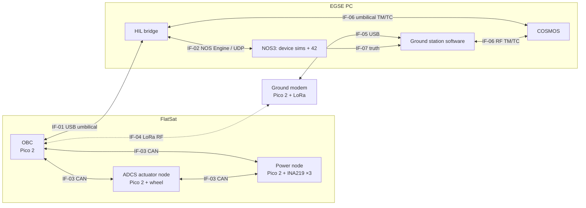

# HITL FlatSat — Interface Control Document

| | |
|---|---|
| Document | HITL-FLATSAT-ICD |
| Version | 1.0 draft |
| Date | 2026-10-01 |
| Status | Draft for review. Byte-level layouts may still change before the firmware freeze at the end of Phase 1. |

## 1. Purpose and scope

This document defines every interface between the elements of the HITL FlatSat:
- the four Pico 2 boards;
- the EGSE (electrical ground support equipment), meaning the HIL bridge and the NOS3 simulation;
- the ground segment (ground station software, the ground radio modem, and COSMOS).

It is the single reference for firmware, ground software and test procedures. When code and this document disagree, the disagreement is a defect: log it and fix one side.

Out of scope: internal software design of each node, and NOS3-internal interfaces, except where the FlatSat touches them.

### 1.1 Conventions

- **Endianness:** CCSDS headers and RF frame headers are **big-endian**, as the CCSDS standards require. Packet payloads, CAN payloads and HIL-link payloads are **little-endian**, matching cFS/NOS3 convention and the native byte order of the RP2350 and x86.
- **Bit numbering:** bit 0 is the least significant bit.
- **Floating point:** `f32` is IEEE-754 single precision.
- **Time:** mission time is CCSDS Unsegmented Time Code (CUC): `u32` seconds since the J2000 epoch, plus `u16` subseconds in units of 2⁻¹⁶ s. This is the same epoch NOS3 uses (`absolute-start-time`).
- **Field types:** `u8/u16/u32` are unsigned, `i8/i16/i32` are signed.

### 1.2 Acronyms

| Acronym | Meaning |
|---|---|
| ADCS | Attitude Determination and Control System |
| APID | Application Process Identifier (CCSDS) |
| EGSE | Electrical Ground Support Equipment |
| EPS | Electrical Power System |
| HIL / SIL | Hardware-in-the-loop / Software-in-the-loop |
| MID | cFS Message ID: the first 16 bits of the CCSDS primary header |
| OBC | On-Board Computer |
| TC / TM | Telecommand / Telemetry |

## 2. System overview



### 2.1 Interface list

| ID | Between | Physical | Protocol | Section |
|---|---|---|---|---|
| IF-01 | OBC ↔ HIL bridge | USB CDC serial | `hil_link` frames | §8 |
| IF-02 | HIL bridge ↔ NOS3 | Docker network | NOS Engine buses, UDP | §8.3 |
| IF-03 | OBC ↔ ADCS node ↔ EPS node | CAN 2.0A, 500 kbit/s | FlatSat CAN protocol | §6 |
| IF-04 | OBC ↔ ground modem | LoRa, 869.525 MHz | FlatSat RF frame | §7 |
| IF-05 | Ground modem ↔ ground station software | USB CDC serial | `hil_link` frames | §7.5 |
| IF-06 | Bridge and ground station software ↔ COSMOS | UDP | CCSDS space packets (§3) | §3.5 |
| IF-07 | NOS3 truth sim → ground station software | UDP | `SIM_42_TRUTH` packet | §7.4 |

### 2.2 Real versus simulated

| Function | Real | Simulated by NOS3 |
|---|---|---|
| Command handling, mode management, ADCS algorithms | OBC firmware | – |
| ADCS sensors: IMU, magnetometer, sun sensors, star tracker, GPS | – | Device sims, read by the OBC through IF-01/IF-02 |
| Reaction wheels (dynamics) | – | 3 wheel sims driving 42 |
| Reaction wheel (physical) | 1 motor + flywheel mirroring wheel 0 (DD-05) | – |
| Magnetorquers | – | Torquer sim driving 42 |
| Power: generation, eclipse, simulated battery | – | EPS sim |
| Power: FlatSat's own consumption, battery, load switches | EPS node + INA219s | – |
| RF link | LoRa (HIL) | Link emulator with the same rules (SIL) |
| Ground station contact windows | – | Computed from 42 truth position (IF-07) |

## 3. Space packet layer (common to IF-01, IF-04, IF-06)

All telemetry and telecommands are CCSDS Space Packets (CCSDS 133.0-B) with cFS-compatible secondary headers. This lets the FlatSat reuse COSMOS's cFS packet conventions and keeps the packets readable by the same tools as the rest of NOS3.

### 3.1 Telemetry packet

| Offset | Size | Field | Notes |
|---|---|---|---|
| 0 | 2 | Stream ID (MID) | Version 0, type 0 (TM), secondary header flag 1, APID. Big-endian. |
| 2 | 2 | Sequence | Grouping flags `11` (unsegmented), 14-bit per-APID sequence count. Big-endian. |
| 4 | 2 | Length | Total packet length − 7. Big-endian. |
| 6 | 4 | Time: seconds | CUC seconds. Big-endian. |
| 10 | 2 | Time: subseconds | CUC subseconds. Big-endian. |
| 12 | 4 | Spare | Zero. Kept for cFS alignment compatibility. |
| 16 | n | Payload | Little-endian fields. |

### 3.2 Command packet

| Offset | Size | Field | Notes |
|---|---|---|---|
| 0 | 2 | Stream ID (MID) | Type 1 (TC), secondary header flag 1, APID. Big-endian. |
| 2 | 2 | Sequence | `0xC000` plus an optional count. |
| 4 | 2 | Length | Total packet length − 7. Big-endian. |
| 6 | 1 | Function code | Selects the command within the MID. |
| 7 | 1 | Checksum | Chosen so the XOR of every byte in the packet equals `0xFF` (cFS convention). |
| 8 | n | Arguments | Little-endian fields. |

The OBC rejects a command, increments its reject counter and raises an event when:
- the checksum fails;
- the length doesn't match the function code;
- the MID or function code is unknown.

### 3.3 Message ID allocation

NOS3/cFS uses `0x08xx`–`0x09xx` for telemetry and `0x18xx`–`0x19xx` for commands. The FlatSat takes the next free blocks, so its packets can coexist with cFS packets in the same COSMOS instance.

| Range | Use |
|---|---|
| `0x0A00`–`0x0A0F` | OBC / system telemetry |
| `0x0A10`–`0x0A1F` | ADCS telemetry |
| `0x0A20`–`0x0A2F` | Power telemetry |
| `0x0A30`–`0x0A3F` | Comms and test telemetry |
| `0x1A00`–`0x1A3F` | Commands, with the same sub-ranges as above |

### 3.4 Maximum packet length

| Path | Maximum packet length | Reason |
|---|---|---|
| Umbilical (IF-01) | 2048 bytes | `HIL_MAX_PAYLOAD` |
| RF (IF-04) | **249 bytes** | 255-byte LoRa payload − 6-byte RF frame overhead |

Every packet in §4 and §5 fits within 249 bytes, so any packet can travel on either path.

### 3.5 Delivery to COSMOS (IF-06)

COSMOS receives packets through two interfaces:

| COSMOS interface | Source | Content |
|---|---|---|
| `FLATSAT_UMB` | HIL bridge | All telemetry, all rates. The AIT test path. |
| `FLATSAT_RF` | Ground station software | What survived the RF link: flight-like, duty-cycle limited. |

Both carry raw space packets over UDP, one packet per datagram. The UDP ports are allocated in the COSMOS configuration when the ground software is built (Phase 2); see open item OI-03.

## 4. Telemetry catalogue

**Rates:** "Umb" is the default rate on the umbilical. "RF" is how the packet travels on the radio link: in the beacon, on request (`OBC_DOWNLINK_PACKET`), or not at all. Periods can be changed per packet with `OBC_SET_TLM_PERIOD`.

| MID | Name | Umb | RF | Content |
|---|---|---|---|---|
| `0x0A00` | `OBC_HK` | 1 Hz | on request | Uptime, mode and the reason for the last mode change, command accept/reject counters, last command MID/FC, reset count and cause, CPU load, node-alive bitmask, CAN TX/RX/error counters, umbilical and RF link state |
| `0x0A01` | `BEACON` | 0.1 Hz | every 10 s | Compact health summary: mode, uptime, simulated battery voltage, real battery voltage, eclipse flag, body-rate magnitude, command counter, fault flags. ≤ 40 bytes in total. |
| `0x0A02` | `EVENT` | async | queued, sent in contact | Event ID `u16`, severity `u8` (debug/info/warning/error/critical), text up to 64 characters |
| `0x0A10` | `ADCS_STATE` | 1 Hz (configurable to 10 Hz) | on request | ADCS mode, estimated body rate `3×f32` rad/s, magnetic field `3×f32` T, sun vector `3×f32` and validity, pointing error `f32` rad, commanded wheel speeds `3×f32` rad/s, simulated wheel speeds `3×f32`, torquer duties `3×i16` (0.01 %), physical wheel commanded and measured speed `2×f32` rad/s |
| `0x0A11` | `ADCS_SENSORS` | 1 Hz | on request | Raw sensor readings: IMU, magnetometer, fine and coarse sun sensors, star tracker quaternion, GPS position/velocity/time, plus a validity bitmask |
| `0x0A20` | `EPS_SIM` | 1 Hz | on request | Simulated spacecraft power from the NOS3 EPS sim: battery voltage and temperature, 3.3/5/12 V rails, solar array voltage, switch states |
| `0x0A21` | `EPS_REAL` | 1 Hz | on request | FlatSat's real power from the EPS node: 3 rails × (V, I, P), battery V/I and charge state, load switch states and faults, EPS node status |
| `0x0A30` | `COMMS_STATS` | 1 Hz | on request | RF frames sent/received, CRC errors, rejected frames, last RSSI/SNR, duty cycle used in the current hour (%), contact state |
| `0x0A31` | `PING_REPLY` | on command | on command | Echoes the token from `OBC_PING`, plus the OBC receive and transmit timestamps. Used for latency measurement (V&V). |

Exact field order and padding are fixed in the packet definition file that firmware and COSMOS are generated from (OI-01). This table defines content and rates.

## 5. Command catalogue

| MID | FC | Name | Arguments | Effect |
|---|---|---|---|---|
| `0x1A00` | 0 | `OBC_NOOP` | – | Increments the command counter and raises an info event |
| | 1 | `OBC_RESET_COUNTERS` | – | Zeros the command and error counters |
| | 2 | `OBC_SET_MODE` | mode `u8` | Requests a mode transition (§5.1). Rejected if the transition isn't allowed. |
| | 3 | `OBC_SET_TIME` | seconds `u32`, subseconds `u16` | Sets the OBC clock; only meaningful when the umbilical time source (§8.2) is absent |
| | 4 | `OBC_PING` | token `u32` | Triggers `PING_REPLY` |
| | 5 | `OBC_SET_TLM_PERIOD` | MID `u16`, period `u16` ms (0 = off) | Changes the umbilical rate of a packet |
| | 6 | `OBC_DOWNLINK_PACKET` | MID `u16` | Sends one instance of the packet over RF |
| | 7 | `OBC_NODE_RESET` | node `u8` | Sends `NODE_CMD` reset to an ADCS or EPS node |
| | 8 | `OBC_REBOOT` | magic `u32` = `0x0B0075ED` | Reboots the OBC. The magic number prevents accidental reboots. |
| `0x1A10` | 0 | `ADCS_NOOP` | – | |
| | 1 | `ADCS_SET_BDOT_GAIN` | gain `f32` | |
| | 2 | `ADCS_SET_SUN_GAINS` | kp `f32`, kd `f32` | |
| | 3 | `ADCS_RW_MANUAL` | wheel `u8`, speed `f32` rad/s | Only accepted in `TEST` mode |
| | 4 | `ADCS_TRQ_MANUAL` | torquer `u8`, duty `i16` (0.01 %) | Only accepted in `TEST` mode |
| `0x1A20` | 0 | `EPS_NOOP` | – | |
| | 1 | `EPS_SWITCH` | switch `u8`, state `u8` | Real load switch on the EPS node, via CAN |
| | 2 | `EPS_SIM_SWITCH` | switch `u8`, state `u8` | Simulated EPS switch in NOS3, via I2C. Turning the switch off powers the matching device sim down. |
| `0x1A30` | 0 | `COMMS_NOOP` | – | |
| | 1 | `COMMS_SET_TX_POWER` | power `i8` dBm | |
| | 2 | `COMMS_SET_BEACON_PERIOD` | period `u16` s | |

### 5.1 Modes

| Value | Mode | ADCS behaviour | Entered when |
|---|---|---|---|
| 0 | `SAFE` | Actuators off | Boot, a critical fault, a lost node, or commanded |
| 1 | `DETUMBLE` | B-dot with magnetorquers | Commanded, or automatically from `SAFE` when rates exceed the threshold |
| 2 | `SUN_POINT` | Reaction-wheel sun pointing | Commanded, or automatically after detumble converges |
| 3 | `LOW_POWER` | Actuators off, reduced telemetry | Simulated battery below threshold |
| 4 | `TEST` | Manual actuator commands allowed | Commanded only |

The automatic transition thresholds are defined in the ADCS design note, not in this document.

## 6. CAN bus (IF-03)

### 6.1 Physical layer

| Parameter | Value |
|---|---|
| Standard | CAN 2.0A (11-bit identifiers), classic frames, up to 8 data bytes |
| Bit rate | 500 kbit/s. **Requires 3.3 V MCP2515 modules; verify the oscillator frequency (8 or 16 MHz) and set the bit timing to match.** |
| Topology | Linear bus, OBC and EPS at the ends, 120 Ω termination at each end, a single twisted pair |
| Nodes | 1 = OBC, 2 = ADCS node, 3 = EPS node. Node 0 is reserved. |
| SIL equivalent | Linux SocketCAN virtual bus `vcan0` |

### 6.2 Identifier scheme

```
CAN ID (11 bits) = message type (7 bits) << 4 | source node (4 bits)
```

A lower ID wins arbitration, so message types are numbered in priority order. Because the source node is part of the ID, two nodes can never send identical IDs.

### 6.3 Message catalogue

All payloads are little-endian.

| Type | CAN ID | Name | From → to | Period | Payload |
|---|---|---|---|---|---|
| `0x01` | `0x011` | `TIME_SYNC` | OBC → all | 1 s | seconds `u32`, subseconds `u16` (6 B) |
| `0x02` | `0x021` | `MODE` | OBC → all | 1 s and on change | mode `u8`, flags `u8` (2 B) |
| `0x04` | `0x04n` | `FAULT` | any → OBC | event | code `u8`, detail `u8`, value `u16` (4 B) |
| `0x10` | `0x101` | `RW_CMD` | OBC → ADCS | 100 ms | wheel `u8`, control mode `u8` (0 off, 1 speed, 2 duty), setpoint `i16` (rpm, or 0.01 % duty), sequence `u8` (5 B) |
| `0x11` | `0x112` | `RW_TLM` | ADCS → OBC | 100 ms | wheel `u8`, status `u8`, measured speed `i16` rpm, setpoint echo `i16`, duty `i8` %, sequence echo `u8` (8 B) |
| `0x20` | `0x203` | `EPS_RAIL` | EPS → OBC | 1 s per rail | rail `u8`, flags `u8`, voltage `u16` mV, current `i16` mA, power `u16` mW (8 B) |
| `0x21` | `0x213` | `EPS_BATT` | EPS → OBC | 1 s | voltage `u16` mV, current `i16` mA, charge state `u8` (0 idle, 1 charging, 2 full, read from the charger status pins), flags `u8` (6 B) |
| `0x28` | `0x281` | `EPS_SW_CMD` | OBC → EPS | event | switch `u8`, state `u8`, sequence `u8` (3 B) |
| `0x29` | `0x293` | `EPS_SW_TLM` | EPS → OBC | 1 s and on change | state mask `u8`, fault mask `u8`, sequence echo `u8` (3 B) |
| `0x70` | `0x70n` | `HEARTBEAT` | each node → all | 1 s | node state `u8`, uptime `u32` s, TX error counter `u8`, RX error counter `u8`, reset cause `u8` (8 B) |
| `0x7E` | `0x7E1` | `NODE_CMD` | OBC → node | event | target node `u8`, command `u8` (1 ping, 2 reset, 3 enter safe), argument `u16` (4 B) |
| `0x7F` | `0x7Fn` | `NODE_ACK` | node → OBC | event | command `u8`, result `u8` (2 B) |

`n` is the sending node's ID.

**Rails measured by the EPS node:**

| Rail | What it measures |
|---|---|
| 0 | Battery output (total FlatSat load) |
| 1 | OBC + LoRa radio |
| 2 | ADCS node including the wheel motor |

**Load switches on the EPS node:**

| Switch | What it powers |
|---|---|
| 0 | ADCS node supply (lets a test power-cycle a node) |
| 1 | Wheel motor driver supply (lets a test cause a wheel failure) |

### 6.4 Bus load

| Message | Frames/s |
|---|---|
| `RW_CMD` + `RW_TLM` | 20 |
| `EPS_RAIL` ×3 + `EPS_BATT` + `EPS_SW_TLM` | 5 |
| `HEARTBEAT` ×3 | 3 |
| `TIME_SYNC` + `MODE` | 2 |
| **Total** | **≈ 30** |

At a worst case of about 135 bits per 8-byte frame including bit stuffing, that's about 4.1 kbit/s, or **≈ 0.8 % of 500 kbit/s**. That leaves margin for later additions and for fault-injection traffic bursts.

### 6.5 Timeouts and failure handling

| Condition | Detected by | Response |
|---|---|---|
| No `HEARTBEAT` from a node for 3 s | OBC | Node marked lost, `EVENT` raised. ADCS node lost → `SAFE`. |
| No `RW_TLM` for 500 ms while a wheel is commanded | OBC | Wheel fault, `EVENT` raised, `SAFE` |
| No `RW_CMD` for 1 s | ADCS node | Stops the wheel, sends `FAULT` |
| No OBC `HEARTBEAT` for 3 s | ADCS and EPS nodes | Enter local safe state (wheel off). Load switches keep their last state. |
| TX or RX error counter > 96 (MCP2515 error-warning level) | Any node | `FAULT` sent and reported in `OBC_HK` |
| Node goes bus-off | That node | Node recovers after 1 s and reports its reset cause in its next `HEARTBEAT` |

## 7. RF link (IF-04, IF-05)

### 7.1 Radio parameters

| Parameter | Value |
|---|---|
| Module | RFM95W (SX1276), 868 MHz variant |
| Frequency | 869.525 MHz, in the 869.40–869.65 MHz sub-band (ERC/REC 70-03: 10 % duty cycle, 500 mW ERP). **Confirm current Spanish rules before the first transmission (OI-04).** |
| Modulation | LoRa, spreading factor 7, 125 kHz bandwidth, coding rate 4/5, 8-symbol preamble, explicit header, hardware CRC on |
| Sync word | `0x12` (private network) |
| TX power | 2 dBm by default. The boards are on the same desk. |

### 7.2 RF frame format

One RF frame per LoRa packet, at most 255 bytes:

| Offset | Size | Field | Notes |
|---|---|---|---|
| 0 | 1 | Header | Bits 7–6 version (0), bits 5–4 frame type (0 TM, 1 TC, 2 beacon), bits 3–0 reserved (0) |
| 1 | 1 | Spacecraft ID | `0x01` |
| 2 | 2 | Frame counter | Per direction, wraps. Big-endian. Gaps in the counter measure frame loss. |
| 4 | n ≤ 249 | Space packet | Exactly one packet (§3) |
| 4+n | 2 | CRC | CRC-16/CCITT-FALSE over bytes 0..3+n, big-endian; the same algorithm as the CCSDS frame error control field |

Receivers drop frames that fail the CRC, have the wrong spacecraft ID or an unknown version, and count them in `COMMS_STATS`.

### 7.3 Airtime and duty-cycle budget

| Frame | Airtime (SF7 / 125 kHz / CR 4/5) |
|---|---|
| 255-byte frame | ≈ 400 ms |
| 40-byte beacon | ≈ 80 ms |

The legal limit is 10 % duty cycle, which is 360 s of transmission per hour. The **design budget is 5 %**, leaving 50 % margin. The OBC enforces it with a rolling one-hour airtime counter and defers non-beacon frames when the budget is used up. A beacon every 10 s uses about 0.8 %; the remainder is for on-request packets and queued events.

This is a deliberate flight-like constraint: the RF link carries health and selected data, while the umbilical carries everything during testing. It's the same split as in a real AIT campaign.

### 7.4 Contact windows (IF-07)

- **Ground station:** ESA ESAC, Villafranca del Castillo, 40.4427° N, 3.9529° W, 10° elevation mask (configurable).
- **Calculation:** the ground station software computes the satellite's elevation from the ECEF position in the 42 truth packet (`POSITION_W`), which `truth42sim` sends over UDP.
- **Outside contact:** the ground station software neither transmits nor delivers received frames.
- **Contact modes**, a ground configuration setting:
  - `orbital`: real windows. At NOS3's 1:1 speed, a pass happens only every few orbits.
  - `always`: for development and demos.
  - `never`: for loss-of-signal tests.

### 7.5 Ground modem (IF-05)

The ground modem is a Pico 2 with an RFM95W, connected over USB. It reuses the `hil_link` framing (§8) with these frame types:

| Frame | Direction | Content |
|---|---|---|
| `RF_TX` | ground software → modem | RF frame to transmit |
| `RF_RX` | modem → ground software | received RF frame; `addr` carries RSSI (`i16`, dBm) and SNR (`i8`, 0.25 dB steps), packed |
| `HEARTBEAT`, `LOG` | as in §8.1 | |

The modem is a pure radio: it doesn't parse frames, so all link logic lives in the ground station software.

In SIL there is no modem. The OBC sends `RF_TX` over the umbilical, and the bridge forwards the RF frame by UDP to the ground station software's link emulator, which applies the contact-window rules, the duty-cycle budget and a configurable loss rate.

## 8. Umbilical: HIL link (IF-01) and bridge mapping (IF-02)

The framing (COBS + CRC-16, header `type | bus | seq | status | addr`) is defined in `nos3/components/hil_bridge/protocol/hil_link.h` and isn't repeated here.

### 8.1 Frame types

| Type | Name | Direction | Status | Meaning in this project |
|---|---|---|---|---|
| `0x01` | `HEARTBEAT` | both | existing | Link keep-alive, at least 1 Hz from the OBC |
| `0x02` | `LOG` | OBC → | existing | Debug text, printed in the bridge terminal |
| `0x10`–`0x12` | `UART_TX/RX/OPEN` | both | existing | NOS3 device sims on `usart_N` |
| `0x20`/`0x21` | `I2C_TXN/RSP` | both | existing | NOS3 device sims on `i2c_N` |
| `0x30`/`0x31` | `SPI_TXN/RSP` | both | existing | NOS3 device sims on `spi_N` |
| `0x40`/`0x41` | `CAN_TXN/RSP` | both | existing | NOS3 device sims on `can_N`. Not related to IF-03. |
| `0x50` | `CI_PKT` | → OBC | **changed** | Umbilical telecommand: one space packet from COSMOS `FLATSAT_UMB` |
| `0x51` | `TO_PKT` | OBC → | **changed** | Umbilical telemetry: one space packet, sent to COSMOS `FLATSAT_UMB` |
| `0x52`/`0x53` | `RADIO_RX/TX` | – | **deprecated** | NOS3 radio sim traffic, not used (DD-03) |
| `0x54` | `RF_TX` | OBC → | **new** | SIL only: RF frame (§7.2) to the ground station link emulator |
| `0x55` | `RF_RX` | → OBC | **new** | SIL only: RF frame from the ground station link emulator |
| `0x60` | `TRQ_CMD` | OBC → | **new** | Magnetorquer command: `bus` = torquer index (0–2), payload = duty `i16` in 0.01 % (−10000…10000) |
| `0x61` | `TIME` | → OBC | **new** | NOS3 simulation time, 1 Hz: seconds `u32`, subseconds `u16` (CUC) |

### 8.2 Time

The OBC has no access to the NOS3 time bus, so the bridge forwards simulation time in `TIME` frames, and the OBC disciplines its clock to them. When no `TIME` frame has arrived for 5 s, the OBC free-runs and sets a flag in `OBC_HK`. This keeps OBC timestamps comparable with 42 truth for V&V. The bridge's source for simulation time is open item OI-02.

### 8.3 How the bridge maps frames to NOS3 (IF-02)

| Frame | NOS3 side |
|---|---|
| UART, I2C, SPI, CAN | NOS Engine at `tcp://nos-engine-server:12000`, same bus names and master address as `hwlib` (see the bridge README) |
| `TRQ_CMD` | UDP to `trq-sim:14242`, ASCII `"<index> <duty %>\n"` with duty as a float from −100 to 100. This is the format `hwlib`'s `libtrq` sends. |
| `TO_PKT` / `CI_PKT` | UDP to/from COSMOS `FLATSAT_UMB` |
| `RF_TX` / `RF_RX` | UDP to/from the ground station link emulator |

**NOS3 device allocation used by the OBC** (from `cfg/sims/sc-1-nos3-simulator.xml`):

| Device | Bus |
|---|---|
| EPS | `i2c_1`, address 0x2B |
| IMU | `can_0` |
| Magnetometer | `spi_2` |
| Fine sun sensor | `spi_1` |
| Star tracker | `usart_10` |
| GPS | `usart_1` |
| Reaction wheels 0–2 | `usart_2`, `usart_3`, `usart_4` |
| Coarse sun sensor | `i2c_2`, address 0x40 |
| Magnetorquers | `TRQ_CMD` |

## 9. Design decisions

| ID | Decision | Rationale |
|---|---|---|
| DD-01 | CCSDS space packets with cFS-compatible headers | Industry-standard packet layer; COSMOS and NOS3 tooling already understand it; the time header gives every packet a timestamp to compare against truth |
| DD-02 | Two telemetry paths: a full-rate umbilical and a duty-cycle-limited RF link | Mirrors a real AIT setup, where the EGSE umbilical carries everything and the RF link is flight-like. Tests can compare the two paths. |
| DD-03 | The NOS3 radio sim and CryptoLib are bypassed | In NOS3's default build, cFS sends 1786-byte AOS/TM transfer frames with SDLS security (`TO_TRANSPORT udp_tf`); a LoRa packet carries at most 255 bytes. Space-link security over the small frame is a stretch goal (OI-06). |
| DD-04 | Contact windows computed by the ground segment from 42 truth | One mechanism that behaves identically in SIL and HIL. The radio sim's built-in gating only exists in SIL. |
| DD-05 | The physical reaction wheel mirrors simulated wheel 0 but doesn't feed the dynamics | A desk-mounted flywheel can't torque the simulated spacecraft. The value is measuring real actuator tracking, lag and power against the commanded profile. The speed scale factor between the simulated wheel and the motor is a configuration item. |
| DD-06 | CAN IDs carry the message type and the source node | Arbitration priority by function; no ID collisions by construction; easy to read on a logic analyser |
| DD-07 | Real load switches on the EPS node | Lets the test campaign inject real power faults (node power cycle, wheel loss), not only simulated ones |
| DD-08 | `hil_link` reused for the ground modem | One framing library, already unit-tested, used on two interfaces |

## 10. Open items

| ID | Item | Owner | Due |
|---|---|---|---|
| OI-01 | Machine-readable packet definition file, generating C headers and COSMOS definitions, to fix exact field layouts | Claude | Phase 1 |
| OI-02 | How the bridge obtains NOS3 simulation time for `TIME` frames (NOS Engine time client) | Claude | Phase 1 |
| OI-03 | COSMOS interface ports, and how `FLATSAT_UMB`/`FLATSAT_RF` are added: `gsw/cosmos` is a nested NOS3 submodule | Claude | Phase 2 |
| OI-04 | Confirm the current Spanish 868 MHz short-range-device rules (frequency, power, duty cycle) | Iker | Before first RF transmission |
| OI-05 | ~~Confirm the coarse sun sensor bus~~ Closed: `i2c_2` @ 0x40 | Claude | Closed 2026-10-01 |
| OI-06 | Stretch: SDLS authentication on the RF link using CryptoLib on the ground side | – | Stretch |
| OI-07 | Bill of materials update: 3 CAN modules plus one spare; 2 load switch channels | Claude | Phase 4 |

## 11. Revision history

| Version | Date | Change |
|---|---|---|
| 1.0 draft | 2026-10-01 | First issue |
