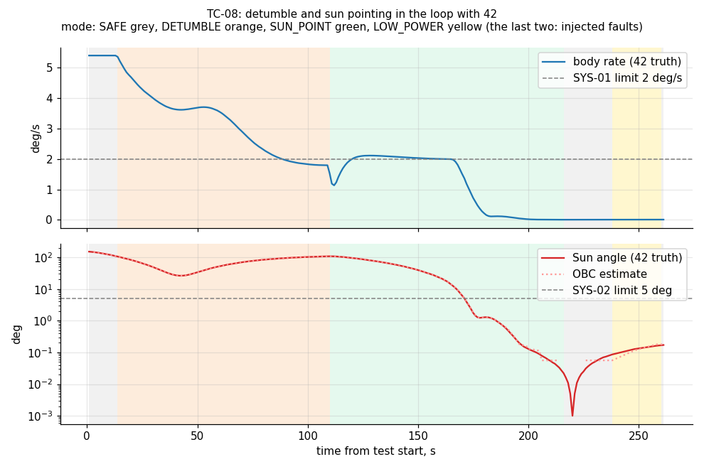
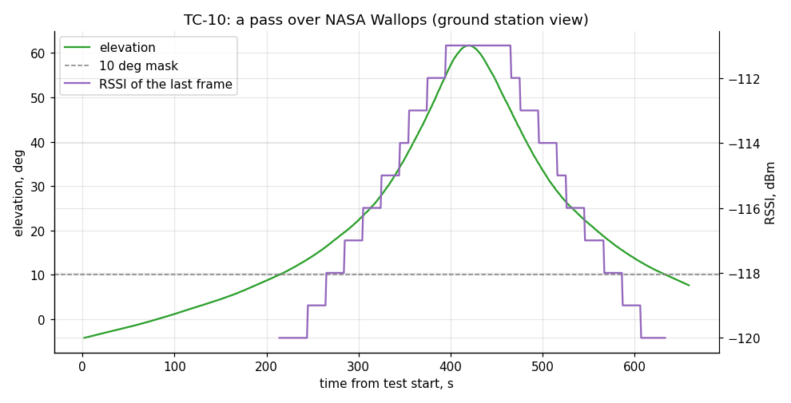
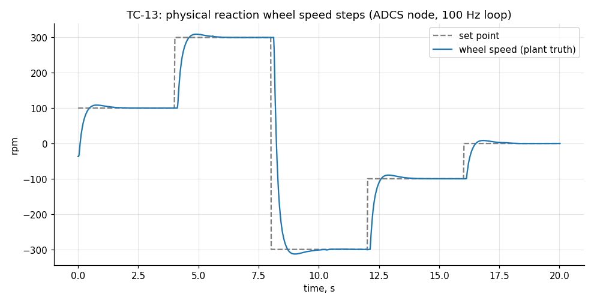
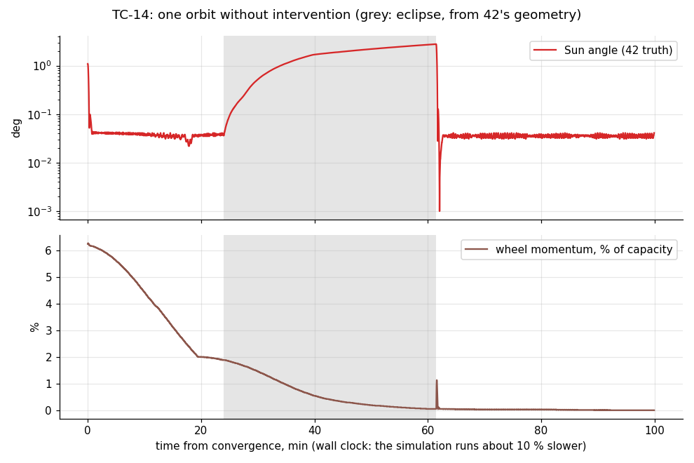

# HITL FlatSat — Test Report

| | |
|---|---|
| Document | HITL-FLATSAT-TR |
| Campaign | `run-20261006-170641` (finished 2026-10-06T19:17:29) |
| Software under test | hitl-flatsat `0246004`, NOS3 fork `ebbbab58` |
| Environment | Software-in-the-loop on N2PC (Linux 6.18.40.1-microsoft-standard-WSL2, 8 CPUs); NOS3 image `ivvitc/nos3-64:20260619`, COSMOS 4.5.0 |
| Plan and procedures | [TEST_PLAN.md](../TEST_PLAN.md), [TEST_PROCEDURES.md](../TEST_PROCEDURES.md) |
| Generated | 2026-10-06 by `tools/test_report.py` |

## 1. Summary

**104 of 106 procedure steps passed**, 0 failed, 2 not run. Not run: TC-15 (2 steps, blocked, informative).

| Requirement | Verdict | Steps passed |
|---|---|---|
| [SYS-01](../../requirements/REQUIREMENTS.md#sys-01) Autonomous detumble | ✅ Verified | 3 / 3 |
| [SYS-02](../../requirements/REQUIREMENTS.md#sys-02) Sun pointing | ✅ Verified | 7 / 7 |
| [SYS-03](../../requirements/REQUIREMENTS.md#sys-03) Sensor and actuator fault response | ✅ Verified | 9 / 9 |
| [SYS-04](../../requirements/REQUIREMENTS.md#sys-04) Subsystem node and bus health | ✅ Verified | 9 / 9 |
| [SYS-05](../../requirements/REQUIREMENTS.md#sys-05) Power management | ✅ Verified | 6 / 6 |
| [SYS-06](../../requirements/REQUIREMENTS.md#sys-06) Commanding and telemetry | ✅ Verified | 38 / 38 |
| [SYS-07](../../requirements/REQUIREMENTS.md#sys-07) RF link and ground segment | ✅ Verified | 20 / 20 |
| [SYS-08](../../requirements/REQUIREMENTS.md#sys-08) Physical reaction wheel | ✅ Verified | 9 / 9 |

| Stage | Result | Duration |
|---|---|---|
| `unit:icd` | ✅ PASS | 0 min 0 s |
| `unit:cosmos-defs` | ✅ PASS | 0 min 1 s |
| `unit:firmware` | ✅ PASS | 0 min 5 s |
| `e2e:bridge` | ✅ PASS | 0 min 11 s |
| `sil:devices` | ✅ PASS | 0 min 26 s |
| `sil:adcs` | ✅ PASS | 4 min 40 s |
| `sil:umbilical` | ✅ PASS | 0 min 51 s |
| `sil:can-nodes` | ✅ PASS | 0 min 37 s |
| `sil:faults` | ✅ PASS | 0 min 55 s |
| `sil:rf-link` | ✅ PASS | 3 min 8 s |
| `sil:rf-pass` | ✅ PASS | 11 min 17 s |
| `sil:failures` | ✅ PASS | 2 min 30 s |
| `sil:hardware-twin` | ✅ PASS | 3 min 21 s |
| `sil:orbit` | ✅ PASS | 102 min 5 s |
| `e2e:cosmos` | ✅ PASS | 0 min 41 s |

## 2. Traceability

Each requirement, the steps that verify it, and their results.

| Requirement | Step | Check | Result |
|---|---|---|---|
| SYS-01 | [TC-02.3](#tc-02) | ADCS laws in closed loop | ✅ PASS |
| SYS-01 | [TC-08.1](#tc-08) | Tumble detected | ✅ PASS |
| SYS-01 | [TC-08.2](#tc-08) | Detumble | ✅ PASS |
| SYS-01 | [TC-15.1](#tc-15) | Detumble benchmark *(informative)* | ⬜ not run |
| SYS-02 | [TC-02.3](#tc-02) | ADCS laws in closed loop | ✅ PASS |
| SYS-02 | [TC-08.3](#tc-08) | Sun pointing converges | ✅ PASS |
| SYS-02 | [TC-08.4](#tc-08) | Pointing held | ✅ PASS |
| SYS-02 | [TC-14.1](#tc-14) | Pointing in sunlight | ✅ PASS |
| SYS-02 | [TC-14.2](#tc-14) | Eclipse detection | ✅ PASS |
| SYS-02 | [TC-14.3](#tc-14) | Reacquisition after eclipse | ✅ PASS |
| SYS-02 | [TC-14.4](#tc-14) | Wheel momentum | ✅ PASS |
| SYS-02 | [TC-15.2](#tc-15) | Sun pointing benchmark *(informative)* | ⬜ not run |
| SYS-03 | [TC-07.1](#tc-07) | Normal operation | ✅ PASS |
| SYS-03 | [TC-07.2](#tc-07) | 1.5 s IMU outage | ✅ PASS |
| SYS-03 | [TC-07.3](#tc-07) | 6 s IMU outage | ✅ PASS |
| SYS-03 | [TC-07.4](#tc-07) | Fault isolated | ✅ PASS |
| SYS-03 | [TC-07.5](#tc-07) | IMU simulator frozen | ✅ PASS |
| SYS-03 | [TC-08.5](#tc-08) | IMU failure in SUN_POINT | ✅ PASS |
| SYS-03 | [TC-12.1](#tc-12) | Reaction wheel failure in SUN_POINT | ✅ PASS |
| SYS-03 | [TC-12.2](#tc-12) | Magnetometer failure in DETUMBLE | ✅ PASS |
| SYS-03 | [TC-14.5](#tc-14) | Health | ✅ PASS |
| SYS-04 | [TC-02.1](#tc-02) | Common flight libraries | ✅ PASS |
| SYS-04 | [TC-06.1](#tc-06) | Nodes up | ✅ PASS |
| SYS-04 | [TC-06.5](#tc-06) | Motor power cut | ✅ PASS |
| SYS-04 | [TC-06.7](#tc-06) | ADCS node held in reset | ✅ PASS |
| SYS-04 | [TC-06.8](#tc-06) | ADCS node released | ✅ PASS |
| SYS-04 | [TC-06.9](#tc-06) | Commanded node reset | ✅ PASS |
| SYS-04 | [TC-12.3](#tc-12) | ADCS node crash in SUN_POINT | ✅ PASS |
| SYS-04 | [TC-12.4](#tc-12) | EPS node crash | ✅ PASS |
| SYS-04 | [TC-12.5](#tc-12) | CAN bus loss | ✅ PASS |
| SYS-05 | [TC-06.2](#tc-06) | FlatSat power telemetry | ✅ PASS |
| SYS-05 | [TC-06.4](#tc-06) | Motor current on the ADCS rail | ✅ PASS |
| SYS-05 | [TC-08.6](#tc-08) | Low battery | ✅ PASS |
| SYS-05 | [TC-08.7](#tc-08) | Battery recovered | ✅ PASS |
| SYS-05 | [TC-13.1](#tc-13) | Rail measurement accuracy | ✅ PASS |
| SYS-05 | [TC-14.2](#tc-14) | Eclipse detection | ✅ PASS |
| SYS-06 | [TC-01.1](#tc-01) | Generated files up to date | ✅ PASS |
| SYS-06 | [TC-01.2](#tc-01) | Codec and RF unit tests | ✅ PASS |
| SYS-06 | [TC-01.3](#tc-01) | COSMOS definitions match the codec | ✅ PASS |
| SYS-06 | [TC-01.4](#tc-01) | COSMOS screens match the definitions | ✅ PASS |
| SYS-06 | [TC-02.1](#tc-02) | Common flight libraries | ✅ PASS |
| SYS-06 | [TC-04.2](#tc-04) | Simulation time | ✅ PASS |
| SYS-06 | [TC-04.4](#tc-04) | IMU | ✅ PASS |
| SYS-06 | [TC-04.5](#tc-04) | Magnetometer | ✅ PASS |
| SYS-06 | [TC-04.6](#tc-04) | Coarse sun sensors | ✅ PASS |
| SYS-06 | [TC-04.7](#tc-04) | Fine sun sensor | ✅ PASS |
| SYS-06 | [TC-04.8](#tc-04) | Star tracker | ✅ PASS |
| SYS-06 | [TC-04.9](#tc-04) | Reaction wheel momentum | ✅ PASS |
| SYS-06 | [TC-04.10](#tc-04) | Reaction wheel torque | ✅ PASS |
| SYS-06 | [TC-04.11](#tc-04) | EPS housekeeping | ✅ PASS |
| SYS-06 | [TC-04.12](#tc-04) | EPS switch command | ✅ PASS |
| SYS-06 | [TC-04.13](#tc-04) | Magnetorquers | ✅ PASS |
| SYS-06 | [TC-04.14](#tc-04) | GPS | ✅ PASS |
| SYS-06 | [TC-05.1](#tc-05) | Housekeeping at 1 Hz | ✅ PASS |
| SYS-06 | [TC-05.2](#tc-05) | Boot state | ✅ PASS |
| SYS-06 | [TC-05.3](#tc-05) | All sensors valid | ✅ PASS |
| SYS-06 | [TC-05.4](#tc-05) | Simulated power telemetry | ✅ PASS |
| SYS-06 | [TC-05.5](#tc-05) | OBC_NOOP | ✅ PASS |
| SYS-06 | [TC-05.6](#tc-05) | Bad checksum rejected | ✅ PASS |
| SYS-06 | [TC-05.7](#tc-05) | Wrong length rejected | ✅ PASS |
| SYS-06 | [TC-05.8](#tc-05) | Mode transitions | ✅ PASS |
| SYS-06 | [TC-05.9](#tc-05) | Command round trip | ✅ PASS |
| SYS-06 | [TC-05.10](#tc-05) | Telemetry rate command | ✅ PASS |
| SYS-06 | [TC-05.11](#tc-05) | Simulated EPS switch | ✅ PASS |
| SYS-06 | [TC-05.12](#tc-05) | Manual actuator command refused outside TEST | ✅ PASS |
| SYS-06 | [TC-08.8](#tc-08) | Invalid gains rejected | ✅ PASS |
| SYS-06 | [TC-11.1](#tc-11) | Telemetry arriving | ✅ PASS |
| SYS-06 | [TC-11.2](#tc-11) | Automatic modes off | ✅ PASS |
| SYS-06 | [TC-11.3](#tc-11) | All sensors valid | ✅ PASS |
| SYS-06 | [TC-11.4](#tc-11) | NOOP with checksum | ✅ PASS |
| SYS-06 | [TC-11.5](#tc-11) | Mode change | ✅ PASS |
| SYS-06 | [TC-11.6](#tc-11) | Ping | ✅ PASS |
| SYS-06 | [TC-11.7](#tc-11) | Event | ✅ PASS |
| SYS-06 | [TC-14.5](#tc-14) | Health | ✅ PASS |
| SYS-07 | [TC-01.2](#tc-01) | Codec and RF unit tests | ✅ PASS |
| SYS-07 | [TC-02.1](#tc-02) | Common flight libraries | ✅ PASS |
| SYS-07 | [TC-09.1](#tc-09) | Ground station status | ✅ PASS |
| SYS-07 | [TC-09.2](#tc-09) | Out of contact | ✅ PASS |
| SYS-07 | [TC-09.3](#tc-09) | AOS | ✅ PASS |
| SYS-07 | [TC-09.4](#tc-09) | Beacons in contact | ✅ PASS |
| SYS-07 | [TC-09.5](#tc-09) | RF round trip and request | ✅ PASS |
| SYS-07 | [TC-09.6](#tc-09) | Corrupted uplink frames | ✅ PASS |
| SYS-07 | [TC-09.7](#tc-09) | 50 % frame loss | ✅ PASS |
| SYS-07 | [TC-09.8](#tc-09) | LOS | ✅ PASS |
| SYS-07 | [TC-09.9](#tc-09) | Beacon control | ✅ PASS |
| SYS-07 | [TC-10.1](#tc-10) | Pass predicted | ✅ PASS |
| SYS-07 | [TC-10.2](#tc-10) | AOS | ✅ PASS |
| SYS-07 | [TC-10.3](#tc-10) | Store and forward across AOS | ✅ PASS |
| SYS-07 | [TC-10.4](#tc-10) | The pass | ✅ PASS |
| SYS-07 | [TC-10.5](#tc-10) | LOS | ✅ PASS |
| SYS-07 | [TC-10.6](#tc-10) | LOS on board | ✅ PASS |
| SYS-07 | [TC-11.9](#tc-11) | Ground station status | ✅ PASS |
| SYS-07 | [TC-11.10](#tc-11) | Contact from COSMOS | ✅ PASS |
| SYS-07 | [TC-11.11](#tc-11) | Command over the radio | ✅ PASS |
| SYS-08 | [TC-02.2](#tc-02) | Wheel speed loop in closed loop | ✅ PASS |
| SYS-08 | [TC-06.3](#tc-06) | Physical wheel speed step | ✅ PASS |
| SYS-08 | [TC-06.5](#tc-06) | Motor power cut | ✅ PASS |
| SYS-08 | [TC-06.6](#tc-06) | Motor power restored | ✅ PASS |
| SYS-08 | [TC-06.10](#tc-06) | Leaving TEST | ✅ PASS |
| SYS-08 | [TC-12.5](#tc-12) | CAN bus loss | ✅ PASS |
| SYS-08 | [TC-13.2](#tc-13) | Wheel steps | ✅ PASS |
| SYS-08 | [TC-13.3](#tc-13) | Mirroring in SUN_POINT | ✅ PASS |
| SYS-08 | [TC-13.4](#tc-13) | Loss of commands | ✅ PASS |

## 3. Results by test case

### TC-01

**Interface definitions**. The interface code generated from the ICD is up to date, the Python codec and RF code pass their unit tests, and COSMOS decodes, encodes and displays exactly what the ICD defines.

| Step | Criterion | Result | Measured |
|---|---|---|---|
| TC-01.1 Generated files up to date | icd_gen --check reports no stale file | ✅ PASS | generated files up to date |
| TC-01.2 Codec and RF unit tests | all Python unit tests pass | ✅ PASS | codec and RF unit tests |
| TC-01.3 COSMOS definitions match the codec | every packet decodes and encodes identically | ✅ PASS | COSMOS definitions match the codec |
| TC-01.4 COSMOS screens match the definitions | every widget and button names an existing item or command | ✅ PASS | COSMOS screens match the definitions |

### TC-02

**Firmware unit tests**. The flight libraries pass their unit tests on a fake HAL, and the wheel speed loop and ADCS laws meet their performance in closed loop with plant models.

| Step | Criterion | Result | Measured |
|---|---|---|---|
| TC-02.1 Common flight libraries | all checks pass (CCSDS, time, scheduler, umbilical, persistence, CAN, node protocol, RF frames) | ✅ PASS | common flight libraries |
| TC-02.2 Wheel speed loop in closed loop | 300 rpm step settles within 5 % in < 1.5 s with < 10 % overshoot; no wind-up | ✅ PASS | wheel speed loop in closed loop |
| TC-02.3 ADCS laws in closed loop | detumble from 5.4-10.2 deg/s to < 2 deg/s in < 120 s; sun pointing within 2 deg in < 150 s; eclipse damping; momentum dump | ✅ PASS | ADCS laws in closed loop |

### TC-03

**HIL bridge end to end (test environment)**. The HIL bridge carries every frame type between a stand-in MCU and NOS3 (test environment qualification).

| Step | Criterion | Result | Measured |
|---|---|---|---|
| TC-03.1 Heartbeat round trip | reply received | ✅ PASS | heartbeat round trip |
| TC-03.2 I2C transaction to the EPS sim | housekeeping values as configured | ✅ PASS | EPS HK: battery raw=25199 temp raw=9000 3v3=3300 5v0=5000 12v=12000 solar array raw=32000 |
| TC-03.3 Invalid bus rejected | BAD_REQ | ✅ PASS | invalid bus rejected with BAD_REQ |
| TC-03.4 UART path | sample sim echoes NOOP | ✅ PASS | UART path: sample sim echoed NOOP on usart_16 |
| TC-03.5 Umbilical TM and TC | both directions delivered | ✅ PASS | umbilical: TO_PKT out, CI_PKT back |
| TC-03.6 RF frames with RSSI/SNR | frame and metadata delivered | ✅ PASS | RF link: RF_TX out, RF_RX back with RSSI/SNR |
| TC-03.7 Torquer command | reaches the torquer sim | ✅ PASS | torquer: TRQ_CMD -25 % on torquer 1 |
| TC-03.8 Simulation time | TIME frames advance 1 s per second | ✅ PASS | simulation time: J2000 814254204.22 s, advancing [1.0, 1.0, 1.0, 1.0] s per frame |

### TC-04

**Sensor and actuator drivers against 42 truth**. Every OBC driver reads or commands its NOS3 device correctly, compared with 42's truth while the spacecraft tumbles.

| Step | Criterion | Result | Measured |
|---|---|---|---|
| TC-04.1 Umbilical link | bridge answers | ✅ PASS | umbilical link — bridge answering |
| TC-04.2 Simulation time | TIME frames advance with the simulation | ✅ PASS | simulation time — 3 TIME frames in 3 s, sim time J2000 814254219 s, advanced 3 s |
| TC-04.3 42 truth stream | receiving | ✅ PASS | 42 truth stream — receiving |
| TC-04.4 IMU | rates within 0.05 deg/s of truth | ✅ PASS | IMU (CAN) — rate [2.000 -2.397 4.388] deg/s, truth [2.000 -2.396 4.389], max error 0.0012 deg/s |
| TC-04.5 Magnetometer | |B| within 2 % and direction within 3 deg of truth | ✅ PASS | magnetometer (SPI) — /B/ 34.44 uT (truth 34.43 uT), angle to truth 0.33 deg |
| TC-04.6 Coarse sun sensors | outputs match cos(Sun angle) within 0.02 | ✅ PASS | coarse sun sensors (I2C) — [0.000 0.746 0.230 0.000 0.625 0.000], max error vs cos(Sun angle) 0.003 |
| TC-04.7 Fine sun sensor | valid frame and error code | ✅ PASS | fine sun sensor (SPI) — alpha 0.00 deg, beta 0.00 deg, error code 1 |
| TC-04.8 Star tracker | quaternion matches truth | ✅ PASS | star tracker (UART) — q [0.7490 -0.2218 0.0484 0.6225] valid 1, /q/ 1.0000, /q.q_truth/ 1.0000 |
| TC-04.9 Reaction wheel momentum | matches truth | ✅ PASS | reaction wheels: momentum — H [0.000000 0.000000 0.000000] Nms, truth [0.000000 0.000000 0.000000] |
| TC-04.10 Reaction wheel torque | 0.5 mN m for 2 s adds 1 mN m s within 5 % | ✅ PASS | reaction wheels: torque — 0.5 mNm for 2 s: H 0.000000 -> 0.001005 Nms (expected +0.001000) |
| TC-04.11 EPS housekeeping | values as configured | ✅ PASS | EPS housekeeping (I2C) — battery 25.20 V 30.0 C, rails 3.30/5.00/12.00 V, solar array 32.00 V, switches 0x00 |
| TC-04.12 EPS switch command | confirmed in housekeeping | ✅ PASS | EPS switch command (I2C) — switch 7 on: confirmed, off: confirmed (read back from housekeeping) |
| TC-04.13 Magnetorquers | commands sent; out-of-range duty rejected | ✅ PASS | magnetorquers (bridge) — 25 % duty on 3 axes then off: sent; out-of-range duty rejected |
| TC-04.14 GPS | position within 500 m and velocity within 1 m/s of truth | ✅ PASS | GPS (UART) — week 341, 150240.8 s, /r/ 6777.8 km, 517 m and 0.3 m/s from truth (ECEF), 0 CRC errors |

### TC-05

**Commanding and telemetry over the umbilical**. The OBC validates commands, reports rejections, and produces its telemetry at the specified rates.

| Step | Criterion | Result | Measured |
|---|---|---|---|
| TC-05.1 Housekeeping at 1 Hz | 0.6-1.4 Hz measured over 5 s | ✅ PASS | OBC_HK at 1 Hz — 1.0 Hz, packets seen: {'ADCS_SENSORS': 5, 'ADCS_STATE': 5, 'COMMS_STATS': 5, 'EPS_REAL': 5, 'EPS_SIM': 5, 'OBC_HK': 5} |
| TC-05.2 Boot state | SAFE, umbilical time source | ✅ PASS | boot state — mode 0 (SAFE), time source 1 (UMBILICAL), packet time J2000 814254221 s |
| TC-05.3 All sensors valid | valid mask 0x3F within 20 s | ✅ PASS | all sensors valid — valid mask 0x3F (expected 0x3F) |
| TC-05.4 Simulated power telemetry | plausible EPS_SIM values | ✅ PASS | EPS_SIM telemetry — battery 25.20 V, solar array 32.00 V |
| TC-05.5 OBC_NOOP | accept count +1 and an event | ✅ PASS | OBC_NOOP — accept count 1 -> 2 |
| TC-05.6 Bad checksum rejected | reject count +1 and an event | ✅ PASS | bad checksum rejected — reject count 0 -> 1 |
| TC-05.7 Wrong length rejected | reject count +1 and an event | ✅ PASS | wrong-length command rejected — reject count 1 -> 2 |
| TC-05.8 Mode transitions | allowed ones happen, refused ones are reported | ✅ PASS | mode transitions — SAFE->TEST 4, TEST->DETUMBLE refused (still 4), TEST->SAFE 0 |
| TC-05.9 Command round trip | 20/20 pings answered, maximum < 100 ms | ✅ PASS | OBC_PING x20 — 20/20 replies, round trip min 2.6 / median 12.9 / max 50.1 ms |
| TC-05.10 Telemetry rate command | EPS_SIM rate follows OBC_SET_TLM_PERIOD | ✅ PASS | OBC_SET_TLM_PERIOD — EPS_SIM packets in 3 s: off 0, back on 3 |
| TC-05.11 Simulated EPS switch | switch on then off, confirmed | ✅ PASS | EPS_SIM_SWITCH — switch 7 on then off, seen in EPS_SIM |
| TC-05.12 Manual actuator command refused outside TEST | rejected with an event | ✅ PASS | TRQ_MANUAL refused in SAFE — rejected with an event |

### TC-06

**CAN nodes, FlatSat power and the physical wheel**. The OBC operates the ADCS and EPS nodes over CAN, including switch and reset fault injection.

| Step | Criterion | Result | Measured |
|---|---|---|---|
| TC-06.1 Nodes up | alive mask 0x0E, CAN traffic without errors | ✅ PASS | ADCS and EPS nodes up — alive mask 0x0E, CAN rx 19 -> 36, errors 0 |
| TC-06.2 FlatSat power telemetry | battery 3.6-4.2 V; rail currents in range | ✅ PASS | EPS_REAL power telemetry — battery 3932 mV, rails [141, 54, 42] mA, switches 0x03, charge 0 |
| TC-06.3 Physical wheel speed step | within 20 rpm of 300 rpm | ✅ PASS | physical wheel tracks 300 rpm — 314 rpm after 1.0 s (incl. telemetry latency) |
| TC-06.4 Motor current on the ADCS rail | rises > 10 mA above idle | ✅ PASS | motor current visible on the ADCS rail — 60 mA vs 42 mA idle |
| TC-06.5 Motor power cut | fault reported, wheel coasts below 150 rpm in 3 s | ✅ PASS | motor switch OFF: fault reported, wheel coasts — driver-enabled bit cleared, fault event True, 42 rpm after 3 s |
| TC-06.6 Motor power restored | wheel back to 300 rpm | ✅ PASS | motor switch ON: wheel back to 300 rpm — 312 rpm |
| TC-06.7 ADCS node held in reset | node lost reported, rail current drops | ✅ PASS | ADCS held in reset: node lost — alive mask 0x0A, ADCS rail 14 mA |
| TC-06.8 ADCS node released | node up with reset cause POWER_ON, wheel resumes | ✅ PASS | ADCS released: power-on reboot, resumes — node up with reset cause POWER_ON, wheel back at 300 rpm |
| TC-06.9 Commanded node reset | acknowledged; reboot reported with reset cause COMMAND | ✅ PASS | OBC_NODE_RESET ADCS — acknowledged, node rebooted with reset cause COMMAND |
| TC-06.10 Leaving TEST | wheel override ends | ✅ PASS | leaving TEST ends the override — physical wheel commanded off in SAFE |

### TC-07

**Sensor fault persistence and isolation**. Isolated misses are tolerated, persistent ones declared and recovered, and one failed device doesn't affect the others.

| Step | Criterion | Result | Measured |
|---|---|---|---|
| TC-07.1 Normal operation | no missed reads | ✅ PASS | no misses in normal operation (SENSOR_MISSES 0) |
| TC-07.2 1.5 s IMU outage | misses counted, no fault declared | ✅ PASS | 1.5 s outage: 8 IMU reads missed (expected 5-10), no fault declared (0 fault events) |
| TC-07.3 6 s IMU outage | one fault and one recovery event | ✅ PASS | 6 s outage: one IMU fault and one IMU recovery event (1 / 1), misses 8 -> 38 |
| TC-07.4 Fault isolated | no other device faulted, umbilical up | ✅ PASS | fault isolated to the IMU: 1 device fault event(s) in total, 0 link drop(s) |
| TC-07.5 IMU simulator frozen | other buses unaffected, umbilical up (42 stalls too: GPS fixes stop and the magnetometer freezes, and both may be declared failed) | ✅ PASS | IMU simulator frozen 6 s: 0 bus device fault(s) besides IMU/GPS/magnetometer, 0 link drop(s) |

### TC-08

**Attitude control in the loop with 42**. From a tumble, the OBC detumbles, hands over to sun pointing and converges on its own, checked against 42's truth; then fault, low-battery and command validation responses.

| Step | Criterion | Result | Measured |
|---|---|---|---|
| TC-08.1 Tumble detected | SAFE to DETUMBLE automatically, torquers active | ✅ PASS | tumbling detected: SAFE -> DETUMBLE (auto) — after 13 s at 5.4 deg/s, torquer duty [8045, 6645, -1262] (0.01 %) |
| TC-08.2 Detumble | below 2 deg/s (42 truth) and SUN_POINT automatically | ✅ PASS | B-dot detumble: DETUMBLE -> SUN_POINT (auto) — 5.39 -> 1.53 deg/s (42 truth) in 96 s |
| TC-08.3 Sun pointing converges | < 5 deg (42 truth) in < 5 min; estimate within 3 deg of truth | ✅ PASS | sun pointing converged (42 truth) — after 72 s: truth 1.27 deg, OBC estimate 1.29 deg, rate 0.126 deg/s |
| TC-08.4 Pointing held | < 5 deg for 30 s; wheel torque within 1 mN m | ✅ PASS | pointing held for 30 s, wheel torque in limits — worst 1.22 deg (truth), peak wheel torque 0.028 mN m, Sun invalid 0 s, sim wheel speeds [54.1, -4.0, -13.5] rad/s, physical wheel 5.6 rad/s |
| TC-08.5 IMU failure in SUN_POINT | SAFE within 10 s; stays in SAFE after recovery | ✅ PASS | IMU failure in SUN_POINT: SAFE, stays there — SAFE 3.9 s after the IMU stopped, IMU recovered, still SAFE 15 s later at 0.01 deg/s |
| TC-08.6 Low battery | LOW_POWER within 20 s; ADCS_STATE drops to 0.1 Hz | ✅ PASS | battery 20 %: LOW_POWER, telemetry reduced — 1 ADCS_STATE packets in 10 s (1 Hz normally), battery 23.28 V |
| TC-08.7 Battery recovered | back to SAFE with reason BATTERY_RECOVERED | ✅ PASS | battery 60 %: back to SAFE (auto) — reason BATTERY_RECOVERED |
| TC-08.8 Invalid gains rejected | NaN and negative gains rejected; auto modes switchable | ✅ PASS | NaN and negative gains rejected; auto modes off — reject count 0 -> 2, AUTO_MODES 0 |

### TC-09

**RF link**. Store and forward, telecommands over RF, frame checks, link loss and beacon control, end to end through the ground station.

| Step | Criterion | Result | Measured |
|---|---|---|---|
| TC-09.1 Ground station status | out of contact, next pass predicted | ✅ PASS | ground station status, next pass predicted — elevation -37.0 deg, range 8314 km, next pass over the ground station in 18.9 min (300 s, max 19.6 deg) |
| TC-09.2 Out of contact | beacons sent but unheard; data held on board and at the ground | ✅ PASS | out of contact: beacons unheard, data held — OBC sent 2 beacons, ground saw 2 outside contact; 5 packets waiting on board, 1 telecommand at the ground, airtime 0.0 % |
| TC-09.3 AOS | stored events delivered; queued telecommand executed | ✅ PASS | AOS: stored data down, queued command up — OBC in contact 1.4 s after AOS; on-board events delivered: 7; the COMMS_NOOP queued before AOS was executed |
| TC-09.4 Beacons in contact | at least 2 in 21 s | ✅ PASS | beacons heard in contact — 2 in 21 s, last: mode 0, uptime 42 s, RSSI -115 dBm, SNR 1.8 dB |
| TC-09.5 RF round trip and request | ping answered; packet downlinked on request | ✅ PASS | ping and packet on request over RF — PING_REPLY after 0.18 s round trip; EPS_SIM on request: battery 25.20 V |
| TC-09.6 Corrupted uplink frames | rejected and counted (CRC) | ✅ PASS | corrupted uplink frames rejected (CRC) — OBC RF_CRC_ERRORS 0 -> 2 |
| TC-09.7 50 % frame loss | frames lost and delivered, both counted | ✅ PASS | 50 % frame loss: some frames lost, some through — 3 lost, 3 delivered in 60 s |
| TC-09.8 LOS | contact lost noticed on board within 60 s | ✅ PASS | LOS: contact lost on board — after 40 s without hails (45 s timeout) |
| TC-09.9 Beacon control | off stops transmissions; 3 s rejected; 10 s restored | ✅ PASS | beacon off, 3 s rejected, back to 10 s — 0 frames sent in 15 s with the beacon off |

### TC-10

**RF pass over NASA Wallops**. A real pass from 42's orbit, against the ground station's own prediction.

| Step | Criterion | Result | Measured |
|---|---|---|---|
| TC-10.1 Pass predicted | AOS within 10 min, > 30 deg maximum elevation | ✅ PASS | pass predicted from 42's truth — AOS in 199 s, 389 s long, max elevation 61.4 deg |
| TC-10.2 AOS | within 15 s of the prediction (simulation time) | ✅ PASS | AOS when predicted — +1 s from the prediction (simulation time, 1 s resolution), elevation 10.0 deg, range 1452 km |
| TC-10.3 Store and forward across AOS | queued telecommand executed; stored event delivered | ✅ PASS | store and forward across AOS — the telecommand queued before AOS was executed and the event stored before AOS came down |
| TC-10.4 The pass | ≥ 20 beacons; maximum elevation within 2 deg of prediction; RSSI ≥ 5 dB stronger at culmination | ✅ PASS | pass: beacons, culmination, link budget — 42 beacons; max elevation 61.7 deg (predicted 61.4); RSSI -120 dBm after AOS, -111 dBm at culmination; 49 frames delivered, 0 lost |
| TC-10.5 LOS | within 15 s of the prediction | ✅ PASS | LOS when predicted — +2 s from the prediction; pass lasted 390 s (predicted 389 s) |
| TC-10.6 LOS on board | noticed within 60 s | ✅ PASS | LOS noticed on board — 25 s after LOS |

### TC-11

**Ground segment end to end (COSMOS)**. NOS3's COSMOS, headless, operates the FlatSat through both the umbilical and the radio.

| Step | Criterion | Result | Measured |
|---|---|---|---|
| TC-11.1 Telemetry arriving | OBC_HK in COSMOS | ✅ PASS | telemetry arriving (OBC_HK) |
| TC-11.2 Automatic modes off | command accepted | ✅ PASS | automatic mode transitions off |
| TC-11.3 All sensors valid | valid mask 63 | ✅ PASS | all six sensors valid |
| TC-11.4 NOOP with checksum | accepted, no rejection | ✅ PASS | NOOP accepted (checksum filled in by the interface) |
| TC-11.5 Mode change | TEST and back to SAFE | ✅ PASS | mode change to TEST and back |
| TC-11.6 Ping | reply in COSMOS | ✅ PASS | ping reply |
| TC-11.7 Event | text in COSMOS | ✅ PASS | event message received |
| TC-11.8 42 truth in COSMOS | SIM_42_TRUTH received | ✅ PASS | 42 truth reaching COSMOS (SIM_42_TRUTH) |
| TC-11.9 Ground station status | GS_STATUS on FLATSAT_RF | ✅ PASS | ground station status on FLATSAT_RF |
| TC-11.10 Contact from COSMOS | beacon received over the radio | ✅ PASS | contact from COSMOS: beacon over the radio |
| TC-11.11 Command over the radio | executed; confirmed in the next beacon | ✅ PASS | command over the radio, confirmed in the next beacon |

### TC-12

**Actuator, node and bus failures**. Fault injection beyond the sensors - a failed wheel, a failed magnetometer during detumble, crashed nodes and a lost CAN bus.

| Step | Criterion | Result | Measured |
|---|---|---|---|
| TC-12.1 Reaction wheel failure in SUN_POINT | wheels declared failed; SAFE within 10 s | ✅ PASS | reaction wheel failure in SUN_POINT — wheels declared failed and SAFE 3.1 s after wheel 1 stopped answering; recovered |
| TC-12.2 Magnetometer failure in DETUMBLE | declared failed; SAFE within 10 s | ✅ PASS | magnetometer failure in DETUMBLE — declared failed and SAFE 5.1 s after the magnetometer stopped; recovered, and DETUMBLE again on its own |
| TC-12.3 ADCS node crash in SUN_POINT | node lost within 5 s; SAFE; restart reported | ✅ PASS | ADCS node crash in SUN_POINT — node lost reported 2.6 s after the crash, SAFE (reason 2); restart reported |
| TC-12.4 EPS node crash | node lost within 5 s; restart reported | ✅ PASS | EPS node crash — node lost reported 2.9 s after the crash; restarted node reporting power again |
| TC-12.5 CAN bus loss | both nodes lost within 5 s; ADCS node stops the wheel; recovery on restore | ✅ PASS | CAN bus loss — both nodes lost after 3.9 s; the ADCS node removed motor drive 0.91 s after the bus went down and went to its safe state; nodes back after the bus returned |

### TC-13

**FlatSat power measurement and wheel performance**. The EPS node's measurements against the plant's true values, and the physical wheel's step responses and mirroring.

| Step | Criterion | Result | Measured |
|---|---|---|---|
| TC-13.1 Rail measurement accuracy | within 2 mA and 10 mV of the true values over four load cases | ✅ PASS | rail measurement accuracy — worst error 1.0 mA, 7.2 mV against the true values over the reading's 2.5 s delivery window; idle: rails [142, 55, 42] mA (true [142.0, 55.0, 42.0]); wheel 300 rpm: rails [160, 54, 60] mA (true [159.9, 55.0, 59.9]); wheel 500 rpm: rails [177, 55, 77] mA (true [177.8, 55.0, 77.8]); ADCS node in reset: rails [113, 54, 14] mA (true [114.0, 55.0, 14.0]) |
| TC-13.2 Wheel steps | within 20 rpm of ±100, ±300 rpm in < 2 s; overshoot < 10 % | ✅ PASS | wheel steps — within 20 rpm after (worst) 0.55 s, overshoot 8.5 %; +0->+100: 0.28 s, 8 %; +100->+300: 0.43 s, 5 %; +300->-300: 0.55 s, 2 %; -300->-100: 0.41 s, 5 %; -100->+0: 0.32 s, 8 % |
| TC-13.3 Mirroring in SUN_POINT | physical wheel at 1:10 of wheel 0 within 20 rpm | ✅ PASS | physical wheel mirrors wheel 0 — command within 0.5 rpm of wheel 0 / 10, true wheel speed within 1.1 rpm of it over 30 s (wheel 0 at -374 rpm) |
| TC-13.4 Loss of commands | motor drive removed within 1.5 s | ✅ PASS | loss of commands (OBC frozen) — the ADCS node removed motor drive 0.94 s after the OBC stopped (1 s command timeout) |

### TC-14

**One-orbit endurance**. A full orbit (about 95 minutes) without intervention: attitude held in sunlight and through eclipse, eclipse detection against 42's geometry, wheel momentum bounded, no faults and no telemetry gaps. About 100 minutes: run with tests/run_all.sh all or tests/run_all.sh orbit.

| Step | Criterion | Result | Measured |
|---|---|---|---|
| TC-14.1 Pointing in sunlight | within 2 deg after convergence | ✅ PASS | pointing in sunlight — worst 0.04 deg over 3147 s of settled sunlight (42 truth), median 0.04 deg |
| TC-14.2 Eclipse detection | within 30 s of 42's geometric eclipse entry and exit | ✅ PASS | eclipse detection — 1 eclipse entries and 1 exits in 42's geometry; OBC detected them within 1 s |
| TC-14.3 Reacquisition after eclipse | within 5 deg in < 5 min | ✅ PASS | reacquisition after eclipse — within 5 deg 0 s after eclipse exit |
| TC-14.4 Wheel momentum | stays below 50 % of capacity | ✅ PASS | wheel momentum bounded — peak 6.3 % of capacity (wheel 10.82 mN m s) |
| TC-14.5 Health | no event of WARNING severity or above, mode SUN_POINT throughout, no telemetry gap > 5 s | ✅ PASS | health over the orbit — 0 events of WARNING severity or above, 3 events in all, modes [2], longest housekeeping gap 2.0 s, 5966 OBC_HK packets |

### TC-15

**Comparison with NASA's reference ADCS** *(blocked)*. The same scenario flown by NOS3's own flight software (cFS with the generic ADCS app), as a benchmark for the FlatSat's detumble and sun pointing. Blocked: in this environment the reference ADCS commands wheel torques far beyond the wheels' limit (NCR-015), so the comparison wouldn't be fair; available on demand.

| Step | Criterion | Result | Measured |
|---|---|---|---|
| TC-15.1 Detumble benchmark | informative: time to 2 deg/s, FlatSat vs cFS | ⬜ not run |  |
| TC-15.2 Sun pointing benchmark | informative: time to 5 deg and steady-state error, FlatSat vs cFS | ⬜ not run |  |

## 4. Defects

16 non-conformance reports were raised up to this campaign: 14 closed, 2 open. The full records are in the [NCR log](../../ncr/NCR_LOG.md).

| NCR | Date | Title | Severity | Status |
|---|---|---|---|---|
| [NCR-001](../../ncr/NCR_LOG.md#ncr-001) | 2026-10-02 | 42 overwrites external actuator commands every 0.2 s | Major | Closed |
| [NCR-002](../../ncr/NCR_LOG.md#ncr-002) | 2026-10-02 | Enum values OFF/ON generated as False/True | Major | Closed |
| [NCR-003](../../ncr/NCR_LOG.md#ncr-003) | 2026-10-02 | GPS port open request lost before the bridge attaches | Minor | Closed |
| [NCR-004](../../ncr/NCR_LOG.md#ncr-004) | 2026-10-02 | Star tracker and wheel reads time out right after start-up | Minor | Closed |
| [NCR-005](../../ncr/NCR_LOG.md#ncr-005) | 2026-10-02 | Isolated late replies raise sensor fault events | Minor | Closed |
| [NCR-006](../../ncr/NCR_LOG.md#ncr-006) | 2026-10-02 | One stalled simulator blocks the bridge for every device | Major | Closed |
| [NCR-007](../../ncr/NCR_LOG.md#ncr-007) | 2026-10-02 | COSMOS Launcher crashes after the legal agreement | Major | Closed |
| [NCR-008](../../ncr/NCR_LOG.md#ncr-008) | 2026-10-04 | OBC misses a node reboot in the node's first second | Minor | Closed |
| [NCR-009](../../ncr/NCR_LOG.md#ncr-009) | 2026-10-05 | B-dot detumble stalls above the hand-over rate in the loop with 42 | Major | Closed |
| [NCR-010](../../ncr/NCR_LOG.md#ncr-010) | 2026-10-05 | 42 applies corrupted wheel torque commands | Critical | Closed |
| [NCR-011](../../ncr/NCR_LOG.md#ncr-011) | 2026-10-05 | Bridge answers "bus busy" to back-to-back transactions; converged event repeats | Minor | Closed |
| [NCR-012](../../ncr/NCR_LOG.md#ncr-012) | 2026-10-05 | 42 stopped advancing 14 s into one COSMOS end-to-end run | Major | Open |
| [NCR-013](../../ncr/NCR_LOG.md#ncr-013) | 2026-10-05 | One lost hail drops the spacecraft out of contact | Minor | Closed |
| [NCR-014](../../ncr/NCR_LOG.md#ncr-014) | 2026-10-06 | A frozen magnetometer is not detected; the detumble silently stops | Major | Closed |
| [NCR-015](../../ncr/NCR_LOG.md#ncr-015) | 2026-10-06 | NOS3's reference ADCS drives the wheels beyond their limit in the SIL environment | Minor | Open |
| [NCR-016](../../ncr/NCR_LOG.md#ncr-016) | 2026-10-06 | Two test scripts report failures the flight software didn't cause | Minor | Closed |

## 5. Notes

- Steps that print measured values show them in the *Measured* column, exactly as the test printed them.
- The environment's limitations (two-body orbit without disturbance torques, first-order plant models, a free-space link model) are listed in the [test plan](../TEST_PLAN.md#8-limitations-of-the-sil-environment).
- The hardware-in-the-loop campaign (Phase 7) will run the same procedures on the FlatSat hardware.
